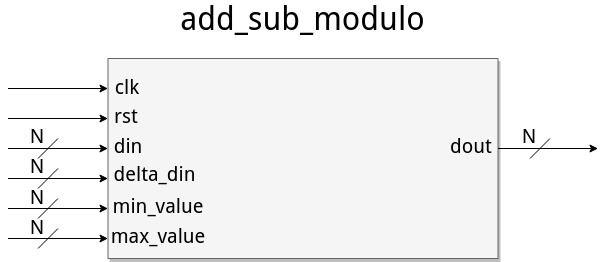
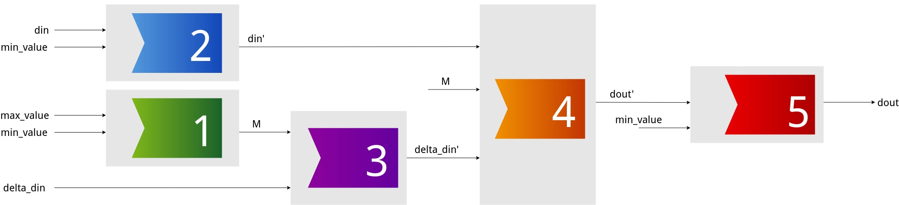

Субмодуль add_sub_modulo реализует операцию «Сложение со сворачиванием в min_value..max_value». Его интерфейс представлен ниже:

 </img>

 
На вход din подается число в формате unsigned, значение которого min_value &le; din &le; max_value, max_value > min_value &ge; 0. На вход delta_din подается число в формате signed.
- Если max_value - min_value + 1 = M – четное число, то delta_din &isin; [-M/2, M/2).
- Если M – нечетное число, то delta_din &isin; [-(M-1)/2, (M-1)/2].

<ins>Пример</ins>

Если M = 12, то delta_din должно принадлежать диапазону [-6, 5].

<ins>Пример</ins>

Если M = 13, то delta_din должно принадлежать диапазону [-6, 6].

На вход min_value, max_value подаются числа формата unsigned, определяющие рабочий диапазон.
На выходе dout формируется сумма din + delta_din, свернутая в диапазон значений min_value..max_value.
Для сложения/вычитания со сворачиванием в min_value..max_value необходимо выполнить следующую последовательность действий:
<ol>
<li> вычислить M = max_value - min_value + 1;</li>
<li> преобразовать din в din’, свернув din из диапазона [min_value, max_value] в [0, М);</li>
<li> преобразовать signed delta_din в unsigned delta_din’, свернув delta_din в диапазон [0, M);</li>
<li> вычислить dout’ = (din’ + delta_din’) mod M;</li>
<li> преобразовать dout’ в dout, свернув dout’ из диапазона [0, M) в [min_value, max_value].</li>
 </ol>

Диаграмма потока данных представлена ниже:

Чтобы запустить тестирование в Modelsim, необходимо:
- Открыть Modelsim;
- Создать новый проект (File->New->Project...) в папке репозитория. Назвать библиотеку по умолчанию add_sub_modulo_lib;
- Добавить в проект исходные файлы (constants_pkg.vhd, sim_constants_pkg.vhd, sim_subprogramms_pkg.vhd, add_modulo.vhd, add_modulo_tb.vhd, signed_to_modulo.vhd, signed_to_modulo_tb.vhd, add_sub_modulo.vhd, add_sub_modulo_tb.vhd);
- Сделать порядок компиляции (Compile -> Compile Order...) согласно списку из предыдущего пункта (0 - constants_pkg.vhd, 1 - sim_constants_pkg.vhd, 2 - sim_subprogramms_pkg.vhd, 3 - add_modulo.vhd, 4 - add_modulo_tb.vhd, 5 - signed_to_modulo.vhd, 6 - signed_to_modulo_tb.vhd, 7 - add_sub_modulo.vhd, 8 - add_sub_modulo_tb.vhd);
- Создать новую библиотеку sim_add_sub_modulo;
- Поместить в библиотеку sim_add_sub_modulo файлы sim_constants_pkg.vhd, sim_subprogramms_pkg.vhd, add_modulo_tb.vhd, signed_to_modulo_tb.vhd, add_sub_modulo_tb.vhd;
- Выбрать для файлов из библиотеки sim_add_sub_modulo версию VHDL-2008;
- Скомпилировать все файлы;
- Выполнить в terminal'е команду do tcl/runregression.tcl. Результат будет выведен в terminal. 
